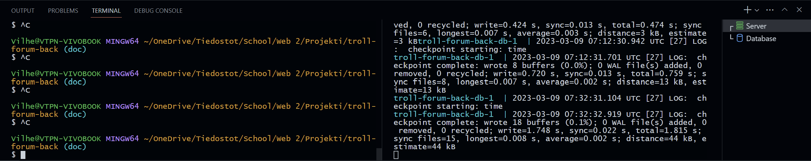

# Trolf - Backend | Setup guide

## Requirements

Before advancing, make sure that you have installed following:

- [Docker](https://docs.docker.com/get-docker/) *(and [WSL](https://learn.microsoft.com/en-us/windows/wsl/install) if using windows)*
- [Node.js and npm](https://nodejs.org/en/) *(Only Node.js versions 18 and up have been tested to work)*
- [Yarn](https://classic.yarnpkg.com/lang/en/docs/install/#windows-stable)

### Optional

If you are using VS Code you can install following extension to improve the dev
experience:

- [Prisma](https://marketplace.visualstudio.com/items?itemName=Prisma.prisma)
- [Prettier](https://marketplace.visualstudio.com/items?itemName=esbenp.prettier-vscode)

## Setup

0. Run `yarn install` to install all dependencies.

1. Start / make sure that you have docker up and running.

2. Create `.env` file with the boilerplate below. Replace the <PLACE_HOLDERS>
   with data described in them. Both the dev server and dev database reads the
   same `.env` file, so you can give any value to `DB_USER`, `DB_PASSWORD` and
   `DB_DB` you like. Just make sure that PostgreSQL accepts them.

```conf
# DB
DB_USER="<STRING_VALUE_HERE>"
DB_PASSWORD="<STRING_VALUE_HERE>"
DB_HOST="localhost"
DB_PORT="5432"
DB_DB="<STRING VALUE HERE>"
DB_URL="postgresql://${DB_USER}:${DB_PASSWORD}@${DB_HOST}:${DB_PORT}/${DB_DB}?schema=public"

# Server
SERVER_PORT="3001"
SERVER_HOST="localhost"

# Crypting
CRYPTING_SALT_ROUNDS="<INTEGER VALUE HERE>"
CRYPTING_JWT_SECRET="<STRING VALUE HERE>"
```

3. Run `yarn db` command to start the dev db. **Notice**: You'll need to open
   second terminal next to the current one in your text editor / ide for the db
   to be run in. This is because the db container is being run in the foreground
   mode so it can be easily be closed after use with CTRL + C
   

4. Run `npx prisma migrate dev` in the other terminal to populate the database
   with tables defined in the prisma schema.

   *If you are using HeidiSQL to view the database, you need to install the*
   *package that it recommends in the connection error*

5. After this run `yarn dev` in the same terminal you ran the previous command
   and the dev server will start.

Now you should be able to access the server with requests sent to
`http://localhost:3001/`!

[Back to README](../../README.md)
